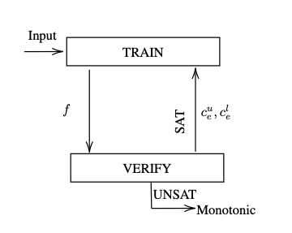
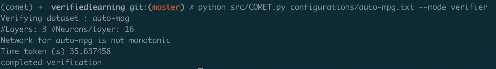
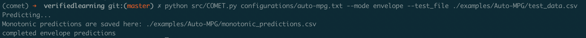
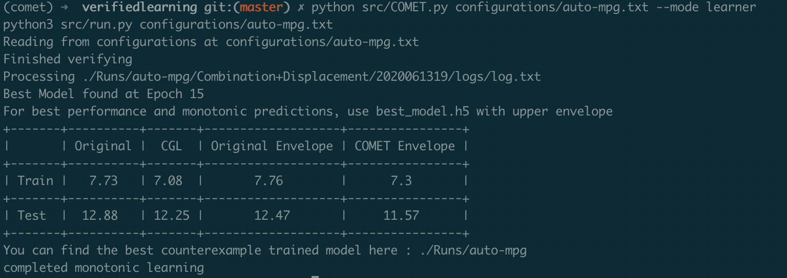

COMET
==========
Counterexample-guided techniques to provably enforce and train a neural network with monotonicity constraints.

  
   

[**Installation**](#installation)
&nbsp; &nbsp; &vert; &nbsp; &nbsp;
[Onboarding a Neural Network](#onboarding-a-neural-network)
&nbsp; &nbsp; &vert; &nbsp; &nbsp;
[Monotonicity Verification](#monotonicity-verification)
&nbsp;&middot;&nbsp;
[Monotonic Envelope Predictions](#monotonic-envelope-predictions)
&nbsp;&middot;&nbsp;
[Training with Monotonicity Constraints](#Training-with-Monotonicity-Constraints)
&nbsp; &nbsp; &vert; &nbsp; &nbsp;
[Paper](docs/paper.pdf)
&nbsp;&middot;&nbsp;
[License (MIT)](License.md)

---

##  Installation

0. Install `python` >= 3.8.3, Install `pip` >= 20.1.1

### Using Python Virtual Environment

1. Setup a Virtual Environment
`pip3 install virtualenv && python3 -m venv comet && source comet/bin/activate`

2. Install Packages
`pip install matplotlib pandas pillow tensorflow scikit-learn sexpdata tensorflow`

3. Install Solvers
`pip install z3-solver`
Download optimathsat (http://optimathsat.disi.unitn.it/pages/download-js.html) and add it to your environment path. Check the installation by running `optimathsat -version`

## Onboarding a Neural Network
To run on example networks skip ahead. To onboard your neural network

0. You need a trained baseline ReLU neural network model (model.h5), weights, and bias as csv files.

1. `cp templates/template.txt configurations/<dataset_name>.txt` and configure COMET for your dataset.

2. `cp templates/DeepModel_Template.py src/Models/DeepModel_<dataset_name>.py` and fill in the code blocks (#TODO: CODE BLOCK) in `make_data` function for COMET to interact with your model.

## Monotonicity Verification
Once you have set up your neural network, you can verify if it is monotonic using:

`python src/COMET.py configurations/<config_file>.txt --mode verifier`. 

This could take a while depending on the size of the network. 

## Monotonic Envelope Predictions
If you are interested in using the monotonic envelope for predictions, set up the configuration file, fill in the code blocks in DeepModel_<dataset_name>.py and run:

`python src/COMET.py configurations/<config_file>.txt --mode envelope --test_file <path to test data csv>`

## Training with Monotonicity Constraints
To carry out counterexample-guided training, set up the configuration file, fill in the code blocks in DeepModel_<dataset_name>.py and run:

`python src/COMET.py configurations/<config_file>.txt --mode learner`

<kbd>CLICK</kbd> for an example

#### Training <em>Auto-MPG</em> dataset Monotonicity Constraints
0. You can find pre-trained model, test/train.csv and weight/bias files in examples/Auto-MPG/

1. You can find the configured file in configurations/auto-mpg.txt

2. You can find the DeepModel_AutoMPG.py in src/Models/

3. The output after running `python src/COMET.py configurations/auto-mpg.txt --mode verifier` is:

<kbd>CLICK</kbd> for output

4. The output after running `python src/COMET.py configurations/auto-mpg.txt --mode envelope --test_file ./examples/Auto-MPG/test.csv` is:

<kbd>CLICK</kbd> for output

5. The output after running `python src/COMET.py configurations/auto-mpg.txt --mode learner` is:

<kbd>CLICK</kbd> for output

